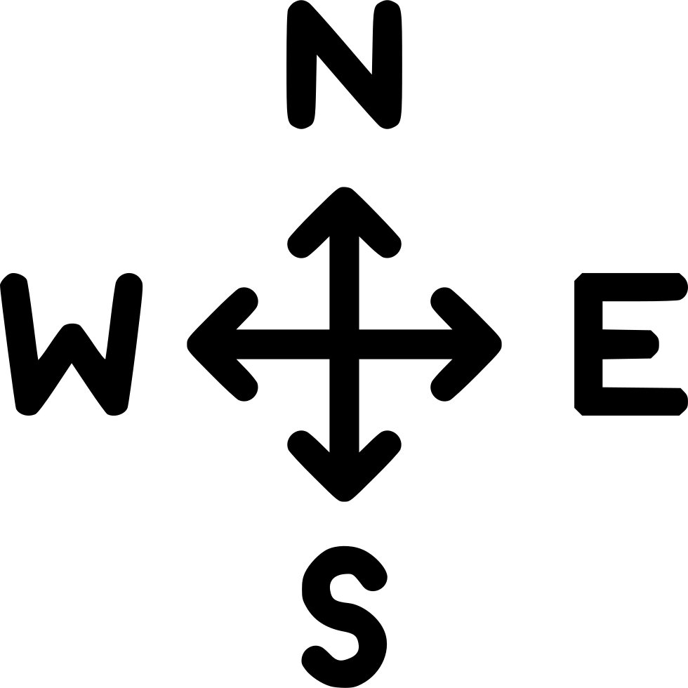
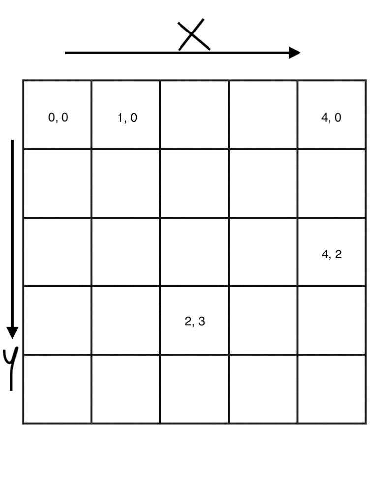

# THAT ROBOT GAME YOU ALWAYS THOUGHT OF PLAYING

### How to play

Start the application with: `gradle bootRun`

and then the application will run at http://localhost:8080

A new game is launched every time you click on the start button on the homepage.

The Robot's initial coordinates are set to `(0, 0)` and it looks towards the `EAST` direction.

You can choose from one of the example moves presented on the page, edit them, or write your own moves.

- The button `Move the Robot!` submits the commands as a chunked POST request to the backend
- The button `RESET` resets everything on the page to start a new game, essentially getting a new robot from the backend and start playing.

It is also to be noted that when one of the example moves is selected, **_a new game is launched_**.

Until and unless a new game is started by either
- refreshing the page
- clicking one of the example moves
- clicking on the `RESET` button

the same game continues for a better user experience.

In the game you will find references to directions and they are the same directions as we perceive in daily life.



### Explanation of an example move

```
POSITION 2 2 WEST
FORWARD 2
RIGHT
FORWARD 1
```
This move will first position the robot on the specified coordinates and direction
and then make the other moves. It's quite possible that the move `POSITION` appears in the middle, at the last or not happens at all.

i.e,
```
FORWARD 2
RIGHT
POSITION 2 2 WEST
FORWARD 1
```
```
FORWARD 2
RIGHT
FORWARD 1
POSITION 2 2 WEST
```
```
FORWARD 2
RIGHT
FORWARD 1
```
All the above codes are valid sets of moves.

### Positions on the grid
The top left corner is `(0, 0)` and the bottom right is `(4, 4)` where `x` progresses horizontally towards the right and `y` progresses vertically towards below.


### Allowed moves

- `POSITION X Y Direction`: Positions the robot on the coordinates `(x, y)` and facing towards the given Direction. Direction value can be `EAST`, `WEST`, `NORTH` or `SOUTH`.
- `LEFT`: Turn the robot towards left
- `RIGHT`: Turn the robot towards right
- `FORWARD X`: Move the robot forward X places in the direction it is facing. It is to be noted that if the given number of moves exceed the available moves in front of the robot on the grid, this command will do nothing.
- `TURNAROUND`: Turn around in opposite direction.
- `WAIT`: Do nothing.

The commands are case-insensitive. So a command like
```
forward 2
RIGHT
Forward 1
```
is completely valid. 

The grammar though is important. So a spelling mistake in the verbs used will lead to inaction due to that particular command.

Commands like `POSITION X Y Direction` and `FORWARD X` which involve parameters, should have spaces in between the verb and the parameters. Also, multiple commands in a chunk should be separated by a new line.

The commands like `WAIT` or `RIGHT` which don't expect a parameter, also work with a parameter. 
e.g. `RIGHT 2` should work, ignoring the `2` being passed and just doing the `RIGHT` thing!
### Limitations
Right now the UI is capable of only handling a `5 * 5` grid game, but this can be enhanced further to accommodate a game of any grid size.
Main changes then would need to be on the front-end. The backend is already capable of doing that with minor adjustments.

Even though the UI is fluid horizontally, the vertical position is fixed which might not give the best experince on smaller and mobile devices. But this can also be improved with some more work.

